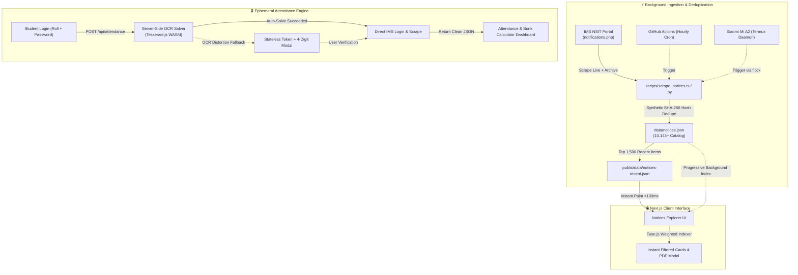

<div align="center">

# 🏛️ IMS NSUT Modern Portal & Ingestion Engine

### *Next-Gen Academic Dashboard, 10,000+ Notices Search, and Attendance Bunk Calculator for NSUT Students*

[](https://nextjs.org)
[](https://typescriptlang.org)
[](https://tailwindcss.com)
[](https://github.com/naptha/tesseract.js)
[](.github/workflows/sync_notices.yml)
[](LICENSE)

<p align="center">
  <b>A unified, high-performance web dashboard & background scraper for Netaji Subhas University of Technology (NSUT).</b><br>
  Featuring instant sub-10ms fuzzy search over 10,000+ historical circulars, live attendance bunk margin analytics, serverless OCR auto-solve, and zero persistent credential storage.
</p>

</div>

---

## ⚡ Key Highlights & Capabilities

| Feature | Description | Performance / Spec |
| :--- | :--- | :--- |
| 🔍 **10,000+ Notices Search** | Full-text fuzzy search across all current circulars & historical archives | **Sub-10ms** client queries (`Fuse.js`) |
| 🏷️ **Faceted Categorization** | Smart filtering by Category (Hostels, Exams, Academics, Placements, Sports) & Year | Zero backend roundtrips |
| 📑 **Embedded Document Modal** | Instant PDF/Document preview with shareable links and direct download | Lazy-loaded sandbox frame |
| 📊 **Attendance Bunk Calculator** | Calculates safe bunk allowances ($>75\%$) and exact recovery lecture requirements | Real-time dynamic math model |
| 🛡️ **Zero-Credential Storage** | Ephemeral, end-to-end TLS session handling. Passwords never touch any database | Zero DB / 100% Privacy Preserving |
| 🤖 **Server-Side OCR Auto-Solve** | Bypasses browser canvas CORS restrictions with Tesseract OCR + 4-digit manual fallback | Stateless AES-256 session tokens |
| 📱 **Outbound Background Sync** | Autonomous daemon for **Xiaomi Mi A2 (Termux)** & GitHub Actions | `flock` protected, <1.5s execution |

---

## 🏗️ System Architecture



---

## 📂 Modular Workspace Layout

```
ims_app/
├── .github/
│   └── workflows/
│       └── sync_notices.yml          # Hourly GitHub Actions cron scraper & auto-commit
├── scripts/
│   ├── scrape_notices.ts             # TypeScript notices scraper & archive parser
│   ├── scrape_notices.py             # Zero-dependency Python 3 scraper for mobile Termux
│   ├── phone_notices_worker.sh       # Outbound sync daemon for Xiaomi Mi A2 / Termux
│   └── lib/
│       └── notice_dedupe.ts          # 16-character synthetic SHA-256 hashing engine
├── data/
│   └── notices.json                  # Complete catalog of 10,143+ official notices
├── public/
│   └── data/
│       ├── notices-recent.json       # Top 1,500 recent notices (<100ms initial load)
│       └── notices.json              # Full static distribution
├── src/
│   ├── app/
│   │   ├── layout.tsx                # Glassmorphic dark UI shell with hydration shields
│   │   ├── globals.css               # Tailored dark gradients & scrollbar styles
│   │   ├── page.tsx                  # Notices Explorer & Faceted Filter Bar
│   │   ├── attendance/page.tsx       # Student Attendance Dashboard & Bunk Calculator
│   │   └── api/
│   │       ├── captcha/route.ts      # CAPTCHA retriever & session token generator
│   │       └── attendance/route.ts   # Serverless attendance proxy & auto-solver
│   ├── components/
│   │   ├── layout/Navbar.tsx         # Modern glassmorphic header
│   │   ├── notices/                  # NoticeCard, SearchBar, FilterBar, NoticeModal
│   │   └── attendance/               # AttendanceCard, BunkCalculator, LoginForm
│   └── lib/
│       ├── ims/                      # Cheerio parser, Bunk math, AES-256 session token
│       ├── captcha/                  # Server-side Tesseract.js OCR engine
│       └── search/                   # Fuse.js search index configuration
├── next.config.mjs                   # Webpack external package rules for WASM/Node
├── tailwind.config.js                # Custom brand tokens & typography
└── package.json
```

---

## 🚀 Quick Start Guide

### 1. Clone & Install Dependencies
```bash
git clone git@github.com:punitr2007/ims_app.git
cd ims_app
npm install
```

### 2. Run Notice Scrapers
```bash
# Scrape live notices only (<2 seconds):
npm run scrape:notices

# Scrape full historical archive (10,000+ circulars):
npm run scrape:archive
```

### 3. Start Development Server
```bash
npm run dev
```
Open **[http://localhost:3000](http://localhost:3000)** in your browser. Press <kbd>/</kbd> anywhere on the page to focus the instant search bar.

---

## 📱 Background Worker Setup (Xiaomi Mi A2 / Termux)

You can run the notices sync worker purely outbound on an attached Android device (Xiaomi Mi A2) with zero open ports and zero ingress security risk:

```bash
# In Termux on the phone:
cd ~/Projects/ims_app
chmod +x scripts/phone_notices_worker.sh

# Run manual test:
./scripts/phone_notices_worker.sh

# Add to crontab (`crontab -e`):
15,45 * * * * /data/data/com.termux/files/home/Projects/ims_app/scripts/phone_notices_worker.sh >/dev/null 2>&1
```

---

## 🔮 Phase 2 Roadmap: Android Mobile App

The Next.js backend routes are designed as a clean **Backend-as-a-Service (BaaS)** providing typed JSON contracts for a future Flutter / Kotlin Android application:

1. **Static Catalog Consumer**: The mobile app fetches `notices-recent.json` from the jsDelivr CDN / raw GitHub for instant offline-first notice caching.
2. **Push Notifications via FCM**: Dispatch alerts when new notices matching target department filters (e.g. *Examination*, *Hostels*) are committed.
3. **Attendance Widget**: Android homescreen glance widget displaying live attendance percentages and bunk allowances.

---

## 📜 Legal & Ethical Notice

This is an independent, open-source student-built utility for Netaji Subhas University of Technology (NSUT). All official circulars, datesheets, and academic data remain the property of IMS NSIT. This project adheres to a strict **zero-storage privacy policy** — student credentials are never stored, logged, or retained.

---

## 🤝 Contributing & License

Distributed under the **MIT License**. Maintained with ❤️ by [Punit Ranjan](https://github.com/punitr2007).
